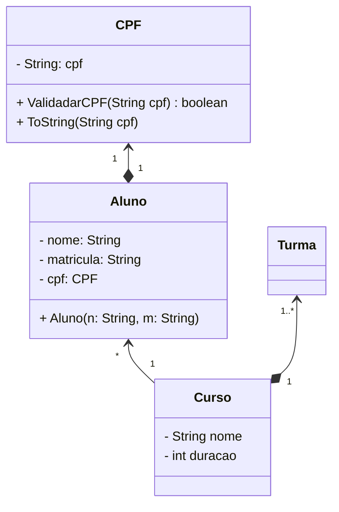

# Diagrama de classes UML

```mermaid

classDiagram

    direction BT
    
    class Aluno{
        - nome: String
        - matricula: String
        - cpf: CPF
        + Aluno(n: String, m: String)
    }

    Aluno "1" *-->"1" CPF
    Curso "1"--> "*" Aluno
    Curso "1" *--> "1..*" Turma
    
  
    
    
    class Curso{
        
        - String nome
        - int duracao
        
    }
    
    class CPF{
        - String: cpf
        
        + ValidadarCPF(String cpf) boolean
        + ToString(String cpf)
        
        
    }
    
    
    
    class Turma{
        
        
        
    }


```

