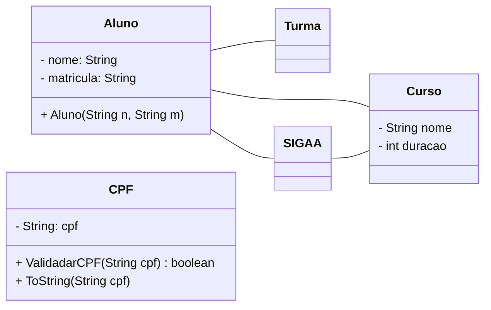

# Diagrama de classes UML

```mermaid

classDiagram

    direction LR
    
    class Aluno{
        - nome: String
        - matricula: String
        + Aluno(String n, String m)
    }
    
    Aluno -- Curso

    Aluno -- Turma
    
    Aluno -- SIGAA
    
    SIGAA -- Curso
    
    
    class Curso{
        
        - String nome
        - int duracao
        
    }
    
    class CPF{
        - String: cpf
        
        + ValidadarCPF(String cpf) boolean
        + ToString(String cpf)
        
        
    }
    
    
    
    class Turma{
        
        
        
    }
    
    class SIGAA{
        
    }


```

