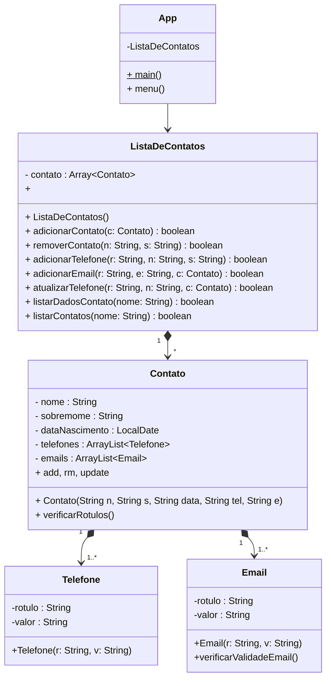

## Agenda Telefônica

```mermaid

classDiagram

    direction TB
 
    ListaDeContatos "1" *--> "*" Contato
    Contato "1" *--> "1..*" Telefone
    Contato "1" *--> "1..*" Email
    App --> ListaDeContatos
    
    
    class App{
        -ListaDeContatos
        + main()$
        + menu()
    }
    
    class ListaDeContatos{
        - contato : Array~Contato~
        
        + ListaDeContatos()
        + adicionarContato(c: Contato)  boolean
        + removerContato(n: String, s: String)  boolean
        + adicionarTelefone(r: String, n: String, s: String) boolean
        + adicionarEmail(r: String, e: String, c: Contato) boolean
        + atualizarTelefone(r: String, n: String, c: Contato) boolean
        + 
        + listarDadosContato(nome: String)  boolean
        + listarContatos(nome: String)  boolean
    }
    
    class Contato{
        - nome : String
        - sobremome : String
        - dataNascimento : LocalDate
        - telefones : ArrayList~Telefone~
        - emails : ArrayList~Email~
        
        + Contato(String n, String s, String data, String tel, String e)
        + verificarRotulos()
        + add, rm, update
    }
    
    class Telefone{
        -rotulo : String
        -valor : String
        
        +Telefone(r: String, v: String)
        
    }
    
    class Email{
        -rotulo : String
        -valor : String
        
        +Email(r: String, v: String)
        +verificarValidadeEmail()
    }


```