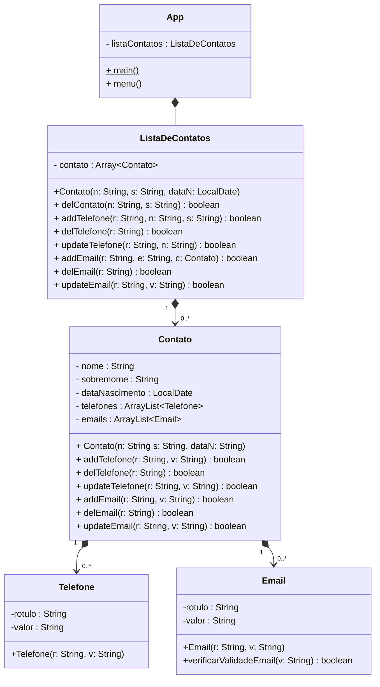

## Agenda Telefônica

```mermaid

classDiagram

    direction TB
 
    ListaDeContatos "1" *--> "0..*" Contato
    Contato "1" *--> "0..*" Telefone
    Contato "1" *--> "0..*" Email
    App *-- ListaDeContatos
    
    
    class App{
        - listaContatos : ListaDeContatos
        + main()$
        + menu()
    }
    
    class ListaDeContatos{
        - contato : Array~Contato~
        
        +Contato(n: String, s: String, dataN: LocalDate)
        + delContato(n: String, s: String)  boolean
        + addTelefone(r: String, n: String, s: String) boolean
        + delTelefone(r: String) boolean
        + updateTelefone(r: String, n: String) boolean
        + addEmail(r: String, e: String, c: Contato) boolean
        + delEmail(r: String) boolean
        + updateEmail(r: String, v: String) boolean
    }
    
    class Contato{
        - nome : String
        - sobremome : String
        - dataNascimento : LocalDate
        - telefones : ArrayList~Telefone~
        - emails : ArrayList~Email~
        
        + Contato(n: String s: String, dataN: String)
        + addTelefone(r: String, v: String) boolean
        + delTelefone(r: String) boolean
        + updateTelefone(r: String, v: String) boolean
        + addEmail(r: String, v: String) boolean
        + delEmail(r: String) boolean
        + updateEmail(r: String, v: String) boolean
        
    }
    
    class Telefone{
        -rotulo : String
        -valor : String
        
        +Telefone(r: String, v: String)
        
    }
    
    class Email{
        -rotulo : String
        -valor : String
        
        +Email(r: String, v: String)
        +verificarValidadeEmail(v: String) boolean
    }


```