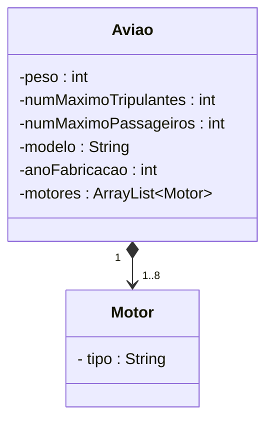
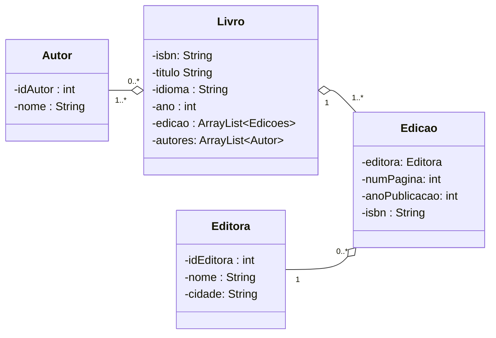
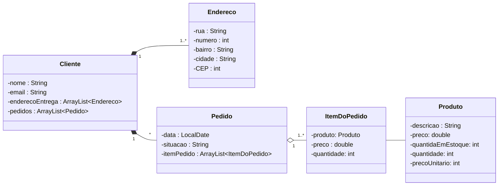

# Jogo de Aviões

```mermaid

classDiagram
    
    Aviao "1"*-->"1..8" Motor
    
    
    class Aviao{
        -peso : int
        -numMaximoTripulantes : int
        -numMaximoPassageiros : int
        -modelo : String
        -anoFabricacao : int
        -motores : ArrayList~Motor~
    }
    
    class Motor{
        - tipo : String
        
    }
    

```

## Livraria

```mermaid

classDiagram
    
    direction LR
    
    Autor "1..*"--o "0..*" Livro
    Livro "1" o--"1..*" Edicao
    Editora "1" --o "0..*" Edicao
    
    
    class Autor{
        -idAutor : int
        -nome : String
        
    }
    
    class Livro{
        -isbn: String
        -titulo String
        -idioma : String
        -ano : int
        -edicao : ArrayList~Edicoes~
        -autores: ArrayList~Autor~
    }
    
    class Editora{
        -idEditora : int
        -nome : String
        -cidade: String
    }
    
    class Edicao{
        -editora: Editora
        -numPagina: int
        -anoPublicacao: int
        -isbn : String
        
    }
    
    


```
# Sistema de Comércio Eletrônico

```mermaid

classDiagram
    
    direction LR
    
    Cliente "1" *-- "1..*" Endereco
    Cliente "1" *-- "*" Pedido
    Pedido "1" o--"1..*" ItemDoPedido
    ItemDoPedido -- Produto
    
    
    class Produto{
        -descricao : String
        -preco: double
        -quantidaEmEstoque: int
        -quantidade: int
        -precoUnitario: int
    }
    class Endereco{
        -rua : String
        -numero : int
        -bairro : String
        -cidade : String
        -CEP : int
    }
    class Pedido{
        -data : LocalDate
        -situacao : String
        -itemPedido : ArrayList~ItemDoPedido~
    }
    
    class ItemDoPedido{
        -produto: Produto
        -preco : double
        -quantidade: int
    }

    
    class Cliente{
        -nome : String
        -email : String
        -enderecoEntrega : ArrayList~Endereco~
        -pedidos : ArrayList~Pedido~
    }
    
    
    
    
    


```

