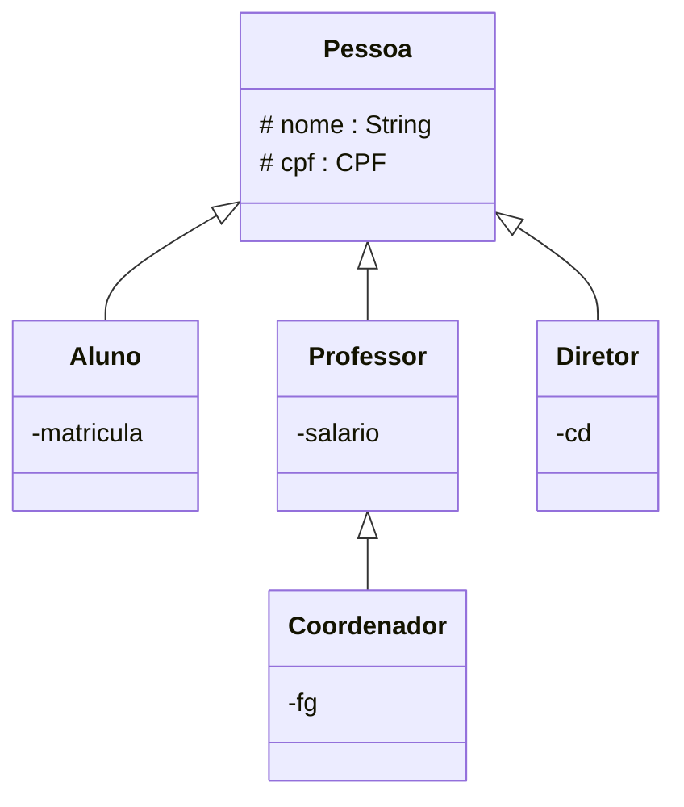
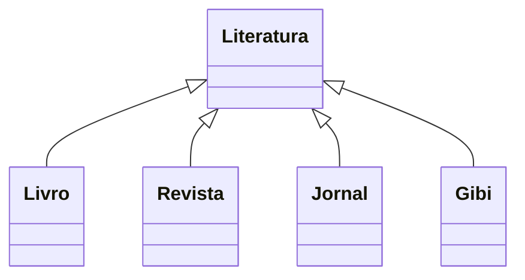
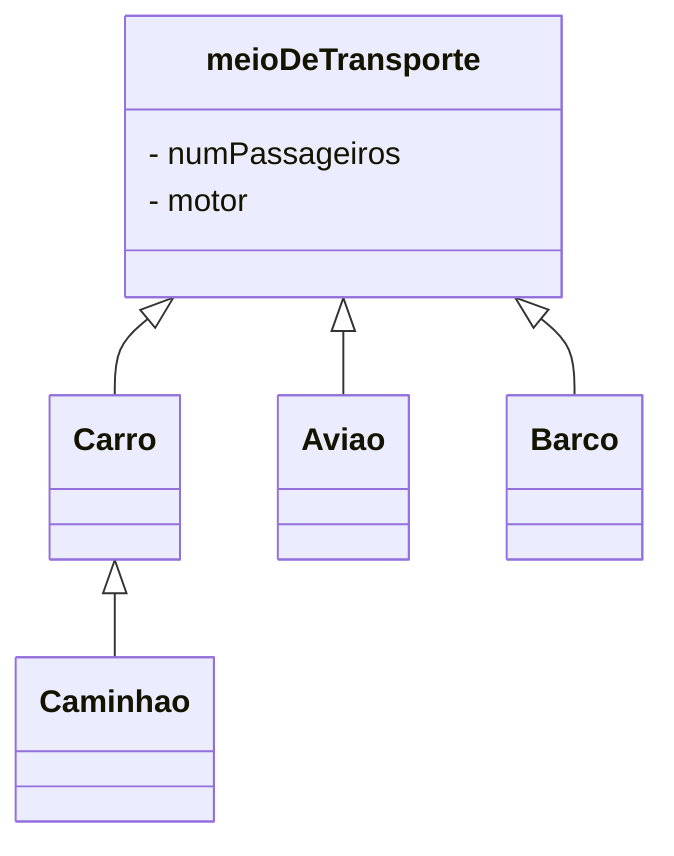
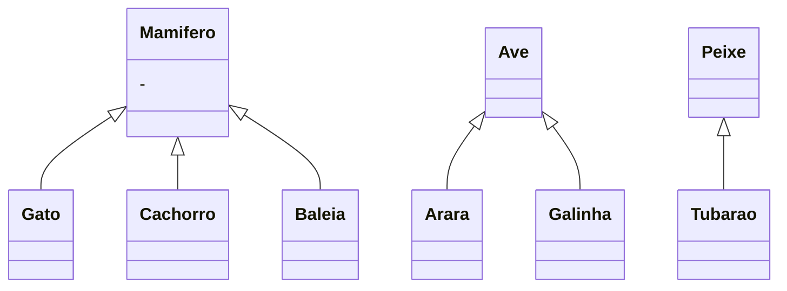

# Exercicios

## 01

```mermaid

classDiagram
    
    Pessoa <|-- Aluno
    Pessoa <|-- Professor
    Professor <|-- Coordenador
    Pessoa <|-- Diretor
    
    class Pessoa{
        # nome : String
        # cpf : CPF
        
    }
    
    class Aluno{
        -matricula
    }
    
    class Professor{
        -salario
    }
    
    class Coordenador{
        -fg
    }

    class Diretor{
      -cd
    }
        


```
## 02

```mermaid
classDiagram

    Literatura <|-- Livro
    Literatura <|-- Revista
    Literatura <|-- Jornal
    Literatura <|-- Gibi
    
    class Literatura{
        
    }
    
    class Livro{
        
    }
    
    class Revista{
        
    }
    class Jornal{
        
    }
    class Gibi{
        
    }
    
    
    
```

## 03

```mermaid
classDiagram

    meioDeTransporte <|-- Carro
    meioDeTransporte <|-- Aviao
    meioDeTransporte <|-- Barco
    Carro <|-- Caminhao
    
    
    class meioDeTransporte{
        - numPassageiros
        - motor
    }
    
    class Carro{
        
    }
    
    class Aviao{
        
    }
    class Barco{
        
    }
    class Caminhao{
        
    }
    
    
    
```

## 04

```mermaid

classDiagram
    
    Mamifero <| -- Gato
    Mamifero <| -- Cachorro
    Mamifero <| -- Baleia
    Ave <| -- Arara
    Ave <| -- Galinha
    Peixe <|-- Tubarao


    class Mamifero{
        - 
    }
    
    class Ave{
       
    }
    class Peixe{
        
    }
    
    class Gato{
        
    }
    
    class Cachorro{
        
    }
    class Arara{
        
    }
    class Galinha{
        
    }
    class Baleia{
        
    }   
    class Tubarao{
        
    }


```
