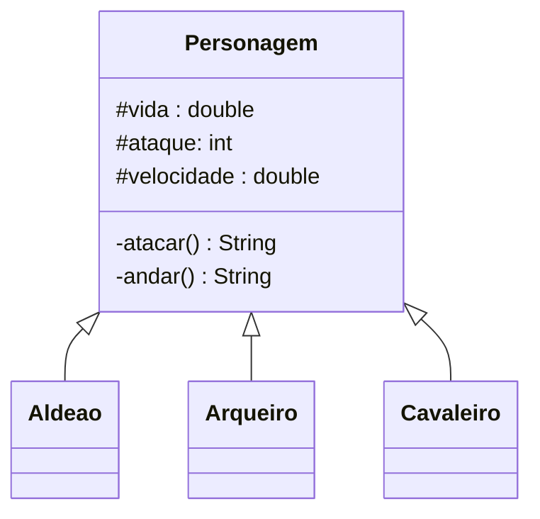

## Java of Empires

```mermaid

classDiagram
    
    Personagem <|-- Aldeao
    Personagem <|-- Arqueiro
    Personagem <|-- Cavaleiro
    
    
    class Personagem{
        #vida : double
        #ataque: int
        #velocidade : double
        
        -atacar() String
        -andar() String
        
    }
        
    class Aldeao{
        
        
    }   
    
    class Arqueiro{
        
    }
        
    class Cavaleiro{
        
    }    
        
        


```