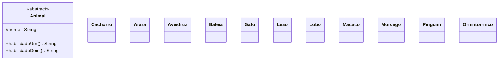

# Jogo de Corrida

```mermaid
classDiagram
    
    

class Animal{
    <<abstract>>
    #nome : String
    
    +habilidadeUm() String
    +habilidadeDois() String
    
}

class Cachorro{
    
}
class Arara{
    
}
class Avestruz{
    
}
class Baleia{
    
}
class Gato{
    
}
class Leao{
    
}
class Lobo{
    
}
class Macaco{
    
}
class Morcego{
    
}
class Pinguim{
    
}
class Ornintorrinco{
    
}


```